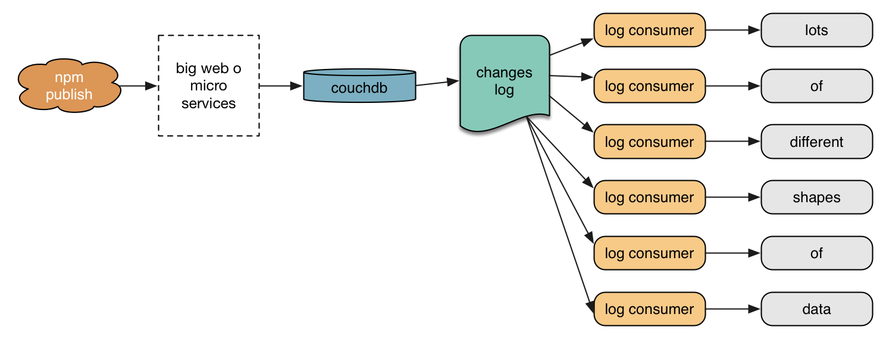

## [fit] __design patterns__ & __modularity__
## [fit] in the npm registry

---

## [fit] C J Silverio, CTO
## [fit] @ceejbot

^ I have npm engineering under my care. The image is not me, but of my operations mascot, Malcolm Tucker.

---

## [fit] human brains are
## [fit] __pattern-detection__ machines

^ talk about patterns & how we unconsciously search for them-- you'll have found a theme to this conference whether anybody involved in it set out to have one or not.

---

## [fit] the process of writing software
## [fit] is __abstraction__ & pattern __extraction__

^ So of course we're obsessed with finding patterns in the software itself.

---

## [fit] patterns in __code__
## [fit] patterns in __systems__

^ we find patterns at every level.

---

## [fit] emergent __patterns__ in npm's registry

^ Descriptively analyze some patterns in the npm registry.

---

## [fit] Let's analyze them not just for how they scale
## [fit] but how they promote __modularity__

^ Modularity is one of the emergent themes of any discussion of node-packaged-modules.

---

# [fit] __registry?__

^ What is the registry?  I hear Isaac doesn't understand this any more. Let's back up & define some terms.

---

## [fit] __registry__, *n*: the system of
## [fit] services that manage __package__
# [fit] tar archives + metadata

^ The thing I have to keep track of for you & serve as fast as possible to you when you ask for it.

---

# [fit] 361,263 packages
# [fit] 2,278,817 million tarballs
# [fit] __medium__ data (fits on 1 disk)

^ bigger than memory, still squeaks in on a single disk

---

# [fit] npm's __largest__ engineering project
# [fit] & its most obvious scaling challenge

----

^ I've learned a lot working on this stuff and I'm going to share it now.

---

## [fit] monoliths
## [fit] microservices
## [fit] transaction logs
## [fit] message queues

^ Here's what we're going to talk about

---

## [fit] monoliths:
## [fit] everything in __one__ big process

^ Our website! The registry used to be this too!

---

## [fit] monoliths are __okay__
## [fit] easy to write & change
## [fit] perf more than good enough

^ They are easy to write & change. This is fantastic when you are still figuring out the problem you're solving. Their performance is more than good enough for services measuring their usage in requests/minute.

---

^ Malcolm shows up & tells you congrats! you won! it's time to scale.

---

## [fit] when you __scale__ perf & team size
## [fit] monoliths are less okay

^ The same factors that make them easy to smush around early make them harder to work on later.

---

^ This is how you scale a monolith.

---

## [fit] it's easy to write highly-coupled code
## [fit] inside a __non-modular__ monolith

^ There are no barriers to it: one repo, change lots of things all over the place. Only a programmer thinking ahead and probably getting it wrong.

---

## [fit] __modularity:__ let's be less vague

^ Let's pause again to define some terms.

---

## [fit] Q: where does __modularity__ come from?
## [fit] A: __information hiding__

^ This term comes to us from a paper I recommend to you all.

---

# [fit] "On the Criteria To Be Used in
# [fit] Decomposing Systems into __Modules__"
# [fit] — D. L. Parnas, 1972

^ One of you should look this up & tweet a link to it on the npmcamp hashtag. The example he works through is very 1972, but you get the idea from it.

---

## [fit] __information__
## [fit] data, its structures, the algorithms

^ Information: data and its structures and the algorithms that operate on them.

---

## [fit] __hide__ info behind an interface
## [fit] so you can __change__ it

^ Somebody looking at what a module exposes to things outside it see only its affordances, only the handles it has chosen to expose. If nothing outside your module can see which algorithm you used, you are free to change it. This is why it's so important.

---

^ Malcolm is very interested because this is 1 of the great secrets of programming. If you master getting it right the first time, tell me all about how you did it, please.

---

## [fit] the hot trend is rewriting
## [fit] monoliths as __microservices__

^ We've got a non-modular monolith; we modularized it & split it out into services, 100% on trend. about half the of the current registry is a web of microservices.

---

## [fit] you're __forced__ to design an API
## [fit] & put implementation inside a service

^ Modularity is sort of forced on you. At least the attempt at it.

---

## [fit] microservices can still
## [fit] __mess up__ modularity

^ You can still write coupled code-- one service that knows far too much about how another service does its job. A human is writing the code. Because the human doing the typing knows it all, the services they develop can know far too much about how data is structured, or what data needs to change when something happens.

---

## [fit] can __scatter__ a task across services
## [fit] making retries & failure hard to cope with

^ You can write services that start doing a task in one place, toss it over to another place, hand the result back to a third service that decides that the work the first two is all wrong.

---

^ I might be mentioning this for a reason. Let's look at what happens when you publish a package.

---

^ Block diagram! This looks modular, right? Lots of microservices, arrows. There's a secret horror in there.

---

# [fit] auth sets up package access on a publish
# [fit] as a __side effect__

---

# [fit] what happens if a service __crashes__?
# [fit] or if validation __rejects__ a publish?

---

^ Malcolm is off to yell at some databases and I'll relax. We'll come back to this.

---

# [fit] after publication, it's a different pattern:
# [fit] the transaction __log__

^ The microservices pattern of distributed system is how everything works up to the moment a publication is committed. Afterward we switch to a different design pattern.

---

## [fit] transaction __log__
## [fit] write-ahead __log__ (WAL)
## [fit] commit __log__

^ I'm relaxed! This is a great pattern! Solid, reliable, the heart of many systems.

---

# [fit] [The Log](https://engineering.linkedin.com/distributed-systems/log-what-every-software-engineer-should-know-about-real-time-datas-unifying): What every software engineer should know
## [fit] about real-time data's __unifying abstraction__

^ The blog post to read, from a LinkedIn engineer. Somebody tweet this!

---

## couchdb's super power
## the __changes__ feed

^ One of couchdb's superpowers is that it has a changes feed, which is sort of a commit log. You can use this to get data about the current state of every package in the registry, in the order of least-recently-modified to most-recently-modified

---

## [fit] registry __followers__:
## [fit] consumers of couchdb's commit logs

^ We use the log pattern to fan data out from a central, standard format into structures more suitable for specific tasks, or to act on the news that a package changed.

---

^ we fan out like whoa after package metadata hits couchdb

---

- distribute __tarballs__
- invalidate our __CDN__'s cache
- populate __postgresdb__ to drive the website
- index data in __ElasticSearch__
- scan packages for __security leaks__
- populate our registry __mirror__
- fire __webhooks__

^ each one of these is a separate process

---

## [fit] each log consumer does
## [fit] __one thing well__

---

^ This is obviously awesome, so awesome the Twelfth Doctor appears to salute it.

---

## [fit] __Estragon:__ Let's fix publication.
## [fit] __Vladimir:__ Fine. But how?

---

^ I am tired of microservices. We messed up the modularization. Unwinding failure is a PITA.

---

## [fit] __message queues__

^ This enters the speculative portion of the talk.

---

## [fit] message queues
## [fit] inversion of __control__

^ Turn the pattern around: instead of imperative code shoving a bunch of mutable data through services, you have an immutable message -- a request for work -- sitting in a message queue.

---

## [fit] __workers__ consume messages
## [fit] & retry or unwind on failure

---

## [fit] a worker does __one thing__
## [fit] puts a new message back into the queue

---

## [fit] you __scale__ by adding more workers

 
 

---

## [fit] queue has to be __reliable__
## [fit] workers can crash

---

## [fit] http://queues.io

^ just to get an idea of how popular they are: look at them all! (note also Kafka, LinkedIn's entry)

---

^ re-imagine publishing a package: Publication is a series of steps, each of which can either succeed or fail. Failure triggers a rollback & report to the requesting client.

---

## [fit] queue disadvantages?
## [fit] we don't have them in production
## [fit] so __∞__ disadvantages!

^ But they're in heavy use in many deployments, so it's a pattern I know will help us clean up some of our pre-publication flow.

---

^ IDEK-- you can mess up writing a queue worker just as well as you can mess anything else up.

---

## [fit] what's the pattern that __emerges__
## [fit] from this discussion of patterns?

^ The registry is a small-ish dist sys and it has a whole pile of system patterns in it. What can we learn?

---

# [fit] there is no __silver bullet__

^ none of these patterns are wrong, none of these patterns are right

---

# [fit] it's __tradeoffs__
# [fit] all the way down

---

# [fit] what __problem__ are you solving?
# [fit] what __tools__ do you have to hand?
# [fit] what is your __team__ experienced with?

---

# [fit] you'll need to fight for __modularity__
## [fit] no matter what you pick

---

## [fit] make your __users happy__ first
## [fit] because that's the hard part

---

## [fit] but know that you can
## [fit] __change your systems__

---

# [fit] we'll be changing ours
# [fit] check back __next year__ to hear how it turned out

---

^ You'll see me again DJing at the afterparty-- please come!
