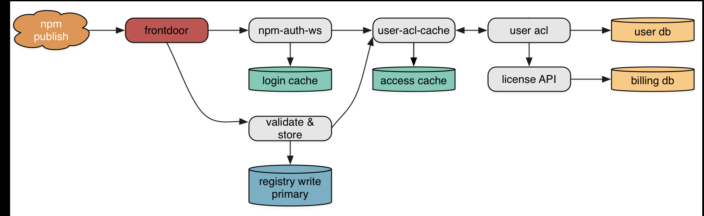
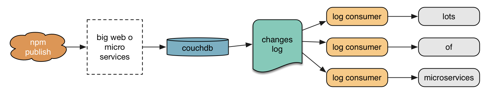

## [fit] __design patterns__ & __modularity__
## [fit] in the npm registry

---

## [fit] C J Silverio, CTO
## [fit] @ceejbot

^ I have npm engineering under my care. Cat Technology Officer.

---

## [fit] human brains are
## [fit] __pattern-detection__ machines

^ Our brain is amazingly good at successively more abstract patterns against things we've experienced before. In comes edges of retina stimulation; out comes an image of our mother's face. And somebody says words and our brains match & produce an image of a tortoise on its back in the desert. Then we recognize a 80s movie adapation of a Philip K Dick novel.

---

## [fit] the process of writing software
## [fit] is __abstraction__ & pattern __extraction__

^ So of course we're obsessed with finding patterns in the software itself.

---

## [fit] patterns in __code__
## [fit] patterns in __systems__

^ we find patterns at every level

---

## [fit] npm's package registry
## [fit] has typical __system__ patterns
## [fit] \(some good, some bad)

^ We are going to descriptively analyze some patterns I see in the npm registry and how well they do with the underlying theme of npm: modularity is good

---

## [fit] Let's analyze them not just for how they scale
## [fit] but for how they promote __modularity__

---

^ What is the registry? Let's back up & define some terms.

---

## [fit] registry, noun:
## [fit] the services that manage
# [fit] __packages:__ tar archive + metadata

^ The thing I have to keep track of for you & serve as fast as possible to you when you ask for it.

---

# [fit] 318,466 packages
# [fit] 1.4 million tarballs
# [fit] __medium__ data (fits on 1 disk)

----

^ okay! now we know what we're discussing. let's go into the patterns

---

## [fit] monoliths
## [fit] microservices
## [fit] transaction logs
## [fit] message queues

^ Here's what we're going to talk about

---

## [fit] monoliths:
## [fit] everything in __one__ big process

^ Our website! The registry used to be this too!

---

## [fit] monoliths are __okay__
## [fit] easy to write & change
## [fit] perf more than good enough early

^ They are easy to write & change. This is fantastic when you are still figuring out the problem you're solving. Their performance is more than good enough for services measuring their usage in requests/minute.

---

^ Malcolm shows up & tells you it's time to scale.

---

## [fit] time to __scale__ perf & team size
## [fit] monoliths are less okay

---

^ This is how you scale a monolith.

---

## [fit] it's easy to write highly-coupled code
## [fit] inside a __non-modular__ monolith

^ Often highly coupled inside: is it decomposed into modules?

---

## [fit] __modularity:__ a digression

---

## [fit] Q: where does __modularity__ come from?
## [fit] A: __information hiding__

---

# [fit] "On the Criteria To Be Used in
# [fit] Decomposing Systems into __Modules__"
# [fit] — D. L. Parnas, 1972

^ This is a pretty cool paper. The example he works through is very 1972, but you get the idea from it.

---

## [fit] __hide__ information
## [fit] __hide__ implementation

^ The details of how you structure your data in memory. Exactly which algorithms you use to change it.

---

## [fit] __hide__ behind an interface
## [fit] so you can __change__ things

^ If nothing outside your module can see which algorithm you used, you are free to change it.

---

^ One of the great secrets of programming.  If you master this, tell me all about how you did it, please.

---

# [fit] our 2.0 rewrite switched to
# [fit] many interconnected __microservices__

^ They all have fairly names like "frontdoor", auth, validate & store, etc.

---

## [fit] you're forced to design an API
## [fit] forced to hide implementation inside a service

^ Modularity is sort of forced on you. At least the attempt at it.

---

## [fit] microservices can still
## [fit] __mess up__ modularity

^ You can still write coupled code-- one service that knows far too much about how another service does its job.

---

## [fit] can scatter a task across services
## [fit] making retries & failure hard to cope with

---

## [fit] I might be mentioning this for a reason.

---

# [fit] reads are __boring__:
# [fit] auth ➜ nginx serving __files__

---

# [fit] mutating data is interesting:
# [fit] let's look at __publishing__

---

^ Block diagram! This looks modular, right? Lots of microservices, arrows. There's a secret horror in there.

---

# [fit] auth sets up package access on a publish
# [fit] as a __side effect__

---

# [fit] what happens if a service __crashes__?
# [fit] or if validation __rejects__ a publish?

---

^ No, it can't. And we'll come back to this.

---

# [fit] after publication, it's a different pattern:
# [fit] the transaction __log__

^ The microservices pattern of distributed system is how everything works up to the moment a publication is commited. Afterward we switch to a different design pattern.

---

## [fit] transaction logs
## [fit] write-ahead logs (WAL)
## [fit] commit logs

^ This is a great pattern! Solid, reliable, the heart of many systems.

---

# [fit] [The Log](https://engineering.linkedin.com/distributed-systems/log-what-every-software-engineer-should-know-about-real-time-datas-unifying): What every software engineer should know
## [fit] about real-time data's unifying abstraction

^ The blog post to read, from a LinkedIn engineer.

---

## couchdb's super power
## the __changes__ feed

^ One of couchdb's superpowers is that it has a changes feed, which is sort of a commit log. You can use this to get data about the current state of every package in the registry, in the order of least-recently-modified to most-recently-modified

---

## [fit] registry __followers__:
## [fit] consumers of couchdb's commit logs

^ We use the log pattern to fan data out from a central, standard format into structures more suitable for specific tasks, or to act on the news that a package changed.

---

^ we fan out like mad after package metadata hits couchdb

---

- distribute __tarballs__
- invalidate our __CDN__'s cache
- populate __postgresdb__ to drive the website
- index data in __ElasticSearch__
- scan packages for __security leaks__
- populate our registry __mirror__
- fire __webhooks__

^ what do these have in common? they handle package changes one a time

---

## [fit] each log consumer does
## [fit] __one thing well__

---

^ This is obviously awesome.

---

## [fit] __Estragon:__ Let's fix publication.
## [fit] __Vladimir:__ Fine. But how?

---

^ I am tired of microservices. We messed up the modularization. Unwinding failure is a PITA.

---

## [fit] __Message queues__

^ This enters the speculative portion of the talk.

---

## [fit] message queues
## [fit] inversion of __control__

^ Turn the pattern around: instead of imperative code shoving a bunch of mutable data through services, you have an immutable message -- a request for work -- sitting in a message queue.

---

## [fit] __workers__ consume messages
## [fit] & retry or unwind on failure

---

## [fit] a worker does __one thing__
## [fit] puts a new message back on the queue

---

## [fit] you __scale__ by adding more workers

 
 

---

## [fit] queue has to be reliable
## [fit] workers can crash

---

## [fit] http://queues.io

^ just to get an idea of how popular they are: look at them all! (note also Kafka, LinkedIn's entry)

---

^ re-imagine publishing a package: Publication is a series of steps, each of which can either succeed or fail. Failure triggers a rollback & report to the requesting client.

---

## [fit] queue disadvantages?
## [fit] we don't have them in production
## [fit] so __∞__ disadvantages!

---

## [fit] writing a worker runs headlong into
## [fit] all the usual problems

---

## [fit] monoliths
## [fit] microservices
## [fit] transaction logs
## [fit] message queues

---

# [fit] there is no __silver bullet__

^ none of these patterns are wrong, none of these patterns are right

---

# [fit] it's __tradeoffs__
# [fit] all the way down

---

^ IDEK

---

# [fit] what __problem__ are you solving?
# [fit] what __tools__ do you have to hand?
# [fit] what is your __team__ experienced with?

---

# [fit] you'll need to fight for __modularity__
## [fit] no matter what you pick

---

## [fit] build your product first
## [fit] because that's the hard part

---

## [fit] but know that you can
## [fit] __change your systems__

---

